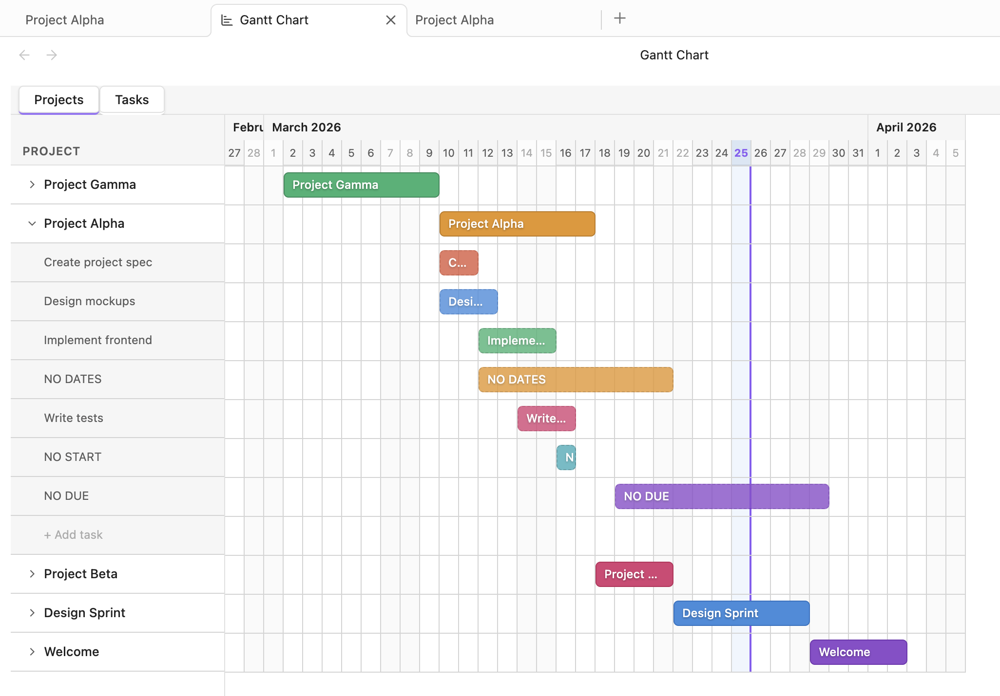

# Gantt Chart — Obsidian Plugin

Interactive Gantt chart view for your Obsidian vault. Projects are built from frontmatter date properties, tasks are parsed from the [Tasks plugin](https://github.com/obsidian-tasks-group/obsidian-tasks) format. Drag, resize, and manage everything visually.



## Features

- **Projects from frontmatter** — any file with `start_date` / `end_date` properties appears as a project bar on the timeline
- **Expandable projects** — click the chevron to reveal individual tasks inside a project file
- **Tasks plugin support** — parses `- [ ] Task name 🛫 2026-03-01 📅 2026-03-15` lines for start/due dates
- **Drag & drop** — move bars to shift both dates, drag edges to resize
- **Double-click to edit** — opens a modal with date pickers for precise control
- **Click to assign dates** — double-click the empty timeline row of an undated task to give it a date instantly
- **Add tasks inline** — "+" button at the bottom of each expanded project to add new tasks without leaving the chart
- **Undated tasks** — tasks without dates are listed below dated ones so you can plan them
- **Delete dates** — right-click a bar → "Delete dates", or select a bar and press `Delete`/`Backspace`
- **Zoom** — `Ctrl`/`Cmd` + scroll wheel to zoom in/out. The grid adapts: days → weeks → months
- **Two tabs** — **Projects** (grouped by file with expand/collapse) and **Tasks** (flat list of all tasks across all files)
- **Auto-refresh** — the chart updates automatically when files change
- **Theming** — uses Obsidian CSS variables, works with any theme (light and dark)

## Tabs

| Tab | What it shows |
|-----|---------------|
| **Projects** | Files with date properties, expandable to show their tasks |
| **Tasks** | All tasks from all files in a flat list with source file badges |

## Settings

| Setting | Description | Default |
|---------|-------------|---------|
| Start date property | Frontmatter property name for project start date | `start_date` |
| End date property | Frontmatter property name for project end date | `end_date` |

Both fields have autocomplete from existing property names in your vault.

## Usage

### Projects

Add frontmatter date properties to any markdown file:

```yaml
---
start_date: 2026-03-10
end_date: 2026-03-25
---
```

The file will appear as a project bar on the Gantt chart.

### Tasks (inside a project file)

Use the [Tasks plugin](https://github.com/obsidian-tasks-group/obsidian-tasks) emoji format:

```markdown
- [ ] Design mockups 🛫 2026-03-10 📅 2026-03-15
- [ ] Implement feature 🛫 2026-03-12 📅 2026-03-20
- [x] Write spec 🛫 2026-03-08 📅 2026-03-10
- [ ] Research (no dates yet)
```

| Emoji | Meaning |
|-------|---------|
| 🛫 | Start date |
| 📅 | Due date |
| ⏳ | Scheduled date (used as start fallback) |

### Interactions

| Action | Result |
|--------|--------|
| Click chevron / project name | Expand/collapse project tasks |
| Click file icon | Open the file in a new tab |
| Drag bar body | Move the task (shifts both dates) |
| Drag bar left edge | Change start date |
| Drag bar right edge | Change end date |
| Double-click bar | Open date edit modal |
| Double-click empty row (undated task) | Assign today's date at click position |
| Double-click task name in sidebar | Open date edit modal |
| Right-click bar | Context menu with "Delete dates" |
| Click bar + `Delete`/`Backspace` | Remove dates from task |
| `Ctrl`/`Cmd` + scroll | Zoom in/out |
| Click "+ Add task" | Inline input to add a new task to the project file |

## Installation

### From release

1. Download `main.js`, `manifest.json`, and `styles.css` from the [latest release](https://github.com/nicpuchko/obsidian-gantt/releases/latest)
2. Create `.obsidian/plugins/obsidian-gantt-chart/` in your vault
3. Move the downloaded files there
4. **Settings → Community plugins → Enable** "Gantt Chart"

### Build from source

```bash
git clone https://github.com/nicpuchko/obsidian-gantt.git
cd obsidian-gantt
npm install && npm run build
```

Copy the built files:

```bash
mkdir -p "/path/to/vault/.obsidian/plugins/obsidian-gantt-chart"
cp build/main.js build/manifest.json build/styles.css \
   "/path/to/vault/.obsidian/plugins/obsidian-gantt-chart/"
```

### For development (symlink)

```bash
ln -s /path/to/obsidian-gantt/build \
   "/path/to/vault/.obsidian/plugins/obsidian-gantt-chart"
npm run dev  # watch mode
```

## Project structure

```
src/
├── main.ts          # Plugin entry point
├── types.ts         # Interfaces and settings defaults
├── constants.ts     # Dimensions, colors, emoji markers
├── utils.ts         # Date parsing, Tasks-line parsing, file updates
├── modals.ts        # Date edit modals (project + task)
├── settings.ts      # Settings tab with autocomplete
└── gantt-view.ts    # Main view: tabs, sidebar, timeline, bars, drag & drop
```

## License

[0-BSD](LICENSE)
